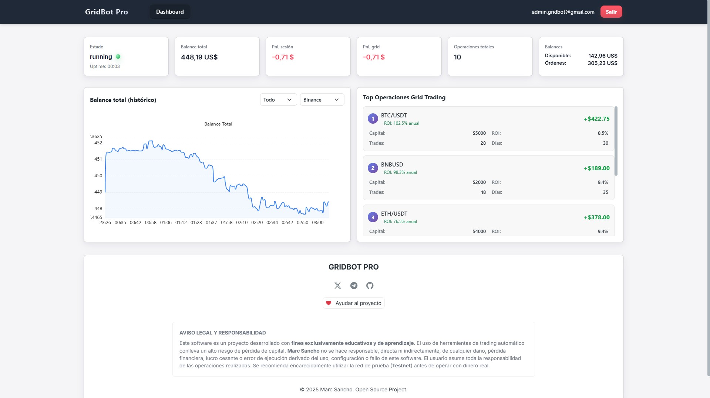

# GridBot Pro

Bot automatizado de trading en grid para Binance con panel web en tiempo real.

## Descripción

GridBot Pro es un sistema de automatización de trading que ejecuta estrategias de grid trading en Binance. Coloca órdenes de compra y venta en varios niveles de precio para capturar volatilidad del mercado de criptomonedas.

## Tecnología

### Backend
- Python 3.13+
- FastAPI (servidor web asincrónico)
- SQLite3 (base de datos)
- CCXT (integración con Binance)

### Frontend
- HTML5 / CSS3 / JavaScript
- Bootstrap 5.3
- Gráficas con Lightweight Charts
- Tema claro

**Captura del dashboard**



## Instalación

### Requisitos
- Python 3.13+
- Cuenta en Binance

### Pasos

1. **Clonar proyecto**
```bash
git clone https://github.com/catlinux/gridbot-pro.git
cd gridbot-pro
```

2. **Crear entorno virtual**
```bash
python -m venv .venv
.venv\Scripts\activate  # Windows
source .venv/bin/activate  # Linux/Mac
```

3. **Instalar dependencias**
```bash
pip install -r requirements.txt
```

4. **Configurar credenciales**
```bash
cp config/env.example .env
# Editar .env con claves API de Binance
```

5. **Ejecutar**
```bash
# Desarrollo (con auto-recarga)
python scripts/watcher_restart.py

# Producción
python main.py
```

Acceder a: `http://localhost:8000`


## Estructura

```
gridbot-pro/
├── core/              # Lógica de trading
├── web/               # Dashboard web
├── config/            # Configuración
├── scripts/           # Utilidades
├── utils/             # Funciones auxiliares
└── data/              # Base de datos
```

## Características

- Automatización 24/7
- Grid trading inteligente
- Panel web en tiempo real
- Historial de operaciones
- Copia de seguridad de datos
- Backtesting para calcular operaciones

## Seguridad

⚠️ **Importante:**
- Nunca commit `.env` con claves reales
- Usar testnet primero
- Rescindir permisos API después de usar
- Hacer 2FA en Binance

## TODO - Funciones por Activar

Las siguientes funcionalidades se están preparando. Se irán activando progresivamente:

- :white_check_mark: **Creación Dashboard** - Página inicial del proyecto
- :white_check_mark: **Connexión exchange** - Conexión a Binance mediante API's
- :white_check_mark: **Gestión usuario** - Apartado de usuario
- :hourglass_flowing_sand: **Multi conexión** - Soporte para varios exchanges
- :white_check_mark: **Gestión  API's** - Reforzar seguridad API's y passwords
- :white_check_mark: **Testnet** - Conexión a Testnet para pruebas
- :stop_button: **Backtesting** - Cálculo de estrategias por histórico de gráficos
- :stop_button: **Creación de los grids** - Formulario para colocar las estrategias
- :stop_button: **Importación estrategias** - Pon a trabajar directamente las mejores estrategias creadas en backtesting
- :stop_button: **Trailing up** - Si el precio sube y sobrepasa tu grid, desplaza automáticamente las órdenes para no quedar fuera de mercado
- :stop_button: **Trailing Stop Loss** - Activación y optimización
- :stop_button: **Take Profit dinámico** - Cálculo inteligente de objetivos
- :stop_button: **Análisis técnico avanzado** - Indicadores adicionales
- :stop_button: **Multi-grid simultáneo** - Operar varios pares al mismo tiempo
- :stop_button: **Estrategias predefinidas** - Plantillas listas para usar
- :hourglass_flowing_sand: **Alertas por Telegram** - Notificaciones en tiempo real
- :stop_button: **Exportación de reportes** - Generación de PDF con estadísticas
- :stop_button: **Exportación a xls** - Crea archivos xls para leer en excel o similar.

## Estado de Calidad (Tests & Lint) ✅

**Fecha (última ejecución):** 2026-01-07

- **Ruff (lint):** ✅ All checks passed (sin errores)
  - Comando: `.venv\Scripts\ruff.exe check --show-fixes .`
- **Pytest (warnings → errores):** ✅ Todos los tests pasan — **7 passed**
  - Comando: `.venv\Scripts\python.exe -W error -m pytest -q`

**Nota:** Se revisaron y añadieron logs en los bloques `except` que antes silencian errores para facilitar el diagnóstico en producción.

## Ayudar al Proyecto

Este proyecto es Open Source y requiere muchas horas de desarrollo y mantenimiento. Si la herramienta te ha sido útil, te ha ayudado a aprender o te ha generado beneficios, considera hacer una pequeña donación. ¡Ayuda a mantener el código actualizado y a añadir nuevas funcionalidades!

Puedes enviar tu apoyo a las siguientes direcciones (Redes baratas y rápidas):

- **Polygon (MATIC):** `0x5dD9a7b2D831A319a68214C11015f64Dbc6bb79c`

- **Solana (SOL):** `GbAFM55PyBb2otqUb1oTTtqzE39fwE6XS7HVsCCwX5Tw`

**NOTA:** No se requiere TAG ni MEMO para estas direcciones. Si tu exchange te obliga a poner uno para realizar el envío, simplemente escribe 0. (Asegúrate de seleccionar la red correcta).

¡Muchas gracias por tu colaboración!

## Aviso Legal

Este software es experimental. El trading de criptomonedas conlleva riesgo de pérdida total. Use bajo su responsabilidad. Pruebe en testnet antes de operar con capital real.
